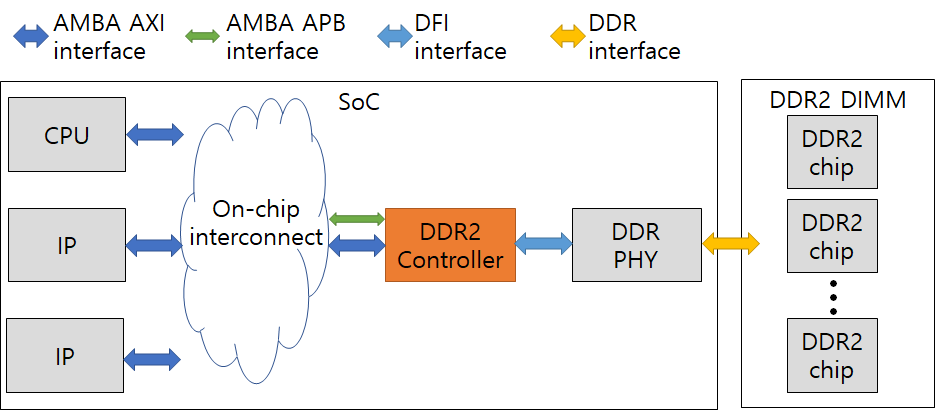
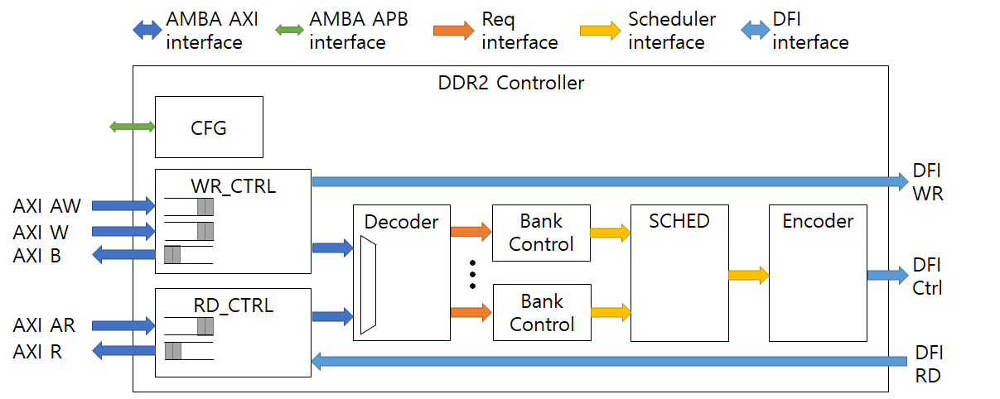

# DDR2 Controller Project

# Objective

The goal of this project is to develop a DDR2 controller to understand DRAM operations and improve hardware design skills.
It uses SystemVerilog language to implement a DDR2 (or its successor) controller.

# Overview

The controller has AMBA APB and AXI interfaces to the on-chip interconnect.
The APB interface is used to configure the controller (e.g., setting a timing parameters) and check status (e.g., reading a debugging register).
The controller receives DRAM access requests via the AXI interface, schedules, converts into DRAM commands, and forwards to the DDRPHY.
The DDRPHY fine-controls the signals to meet the tight sub-cycle DRAM timing parameters.

# Block Diagram

# Protocols

This project utilizes industry standard protocols.

## AMBA AXI/APB
This is an industry-standard for on-chip communication among hardware IPs.
For more details, refer to the AMBA documents under the DOC folder.

## DFI
This is an industry-standard for communication between DDR controller and DDR PHY.
Note that this project utilizes a simplified version of the protocol and has an old version of the standard under the DOC folder.

## DDR2

For a complete specification, refer to JEDEC DDR2 standard (JESD79-2F).

For a condense documentation, refer to the Micron datasheet (under the DOC folder)

# SystemVerilog Interface

This design heavily utilizes "interface" in SystemVerilog to simplify the connections and ease verification.
Some features of the interface are not synthesizeable and we added "synthesis translate_off" and "synthesis translate_on" for such features.

# Timing Parameters

## DRAM Timing Parameters
### Before you issue an ACTivate or REFresh command, it must meet

(intra-bank)
- tRC
- tRP
- tRFC

(inter-bank)
- tRRD
- tFAW

### Before you issue a READ command, it must meet

(intra-bank)
- tRCD
- tWTR (in more details, (CL-1) + (BL/2) + tWTR)

(inter-bank)
- tCCD

### Before you issue a WRite command, it must meet

(intra-bank)
- tRCD

(inter-bank)
- tCCD

### Before you issue a PREcharge command, it must meet

(intra-bank)
- tRAS (min)
- tRTP
- tWR

## Row Open Counter
The controller will leave an accessed row open for ROW_OPEN_CNT cycles, so that a following access on the same row can benefit from the open row. If there's an row hit, the counter will reset and keep the row open for another ROW_OPEN_CNT cycles. Otherwise, it will close the row.
